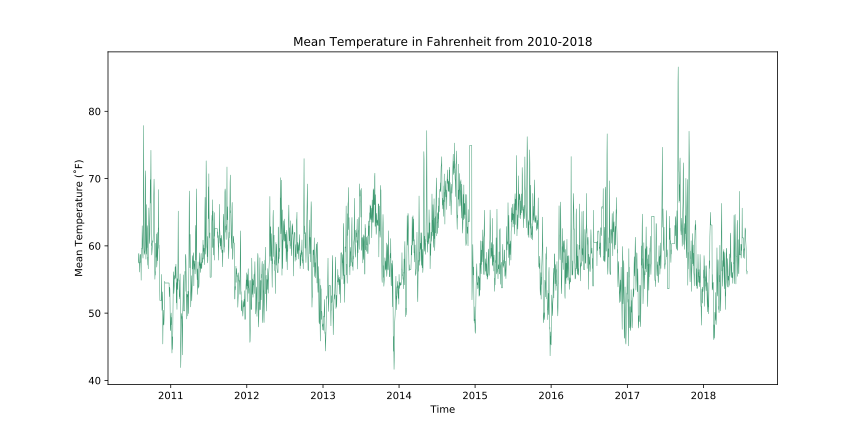
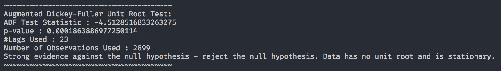
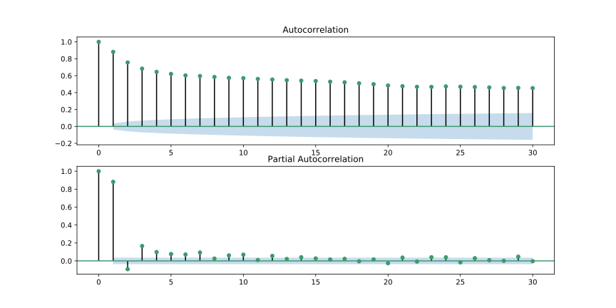

# Pricing Weather Derivatives

## Contents
1. Introduction
2. Approach & Methodology
3. Results
4. Future Work

## Introduction
### Background
Despite great advances in technology over the years, we humans remain unable to control many forces of Mother Nature, weather being one of them. Weather affects everyone and has not only a prominent role from an environmental standpoint, but also from a business one. In fact, it is estimated that nearly 20% of the U.S. economy is affected by the weather, including industries ranging from obvious ones like agriculture and energy to less transparents ones like entertainment and travel. As former commerce secretary William Daley stated in a 1998 testimony to Congress, "Weather is not just an environmental issue, it is a major economic factor. At least $1 trillion of our economy is weather-sensitive."

Weather risk is incredibly unique. It's localized, can't be modified or controlled and still cannot be precisely and consistently predicted. Until recently, there weren't many financial instruments corporations could use to hedge against weather risk. Typically, insurance has been the go-to tool for protection against weather conditions, but it has one big problem: it only provides protection against calamitous disasters. It doesn't have the capability to protect against slight changes in weather that can still have adverse profitability consequences. And thus, in the late 1990s, the weather derivative was born.

Weather derivatives come in multiple flavors; common underlyings include rainfall or temperature (we'll be pricing these). The general structure of a weather derivative with a temperature (˚F) underlying is relatively simple: weather is quantified and indexed in terms of monthly or seasonal average temperatures. Following that, a dollar amount is then attached to each index value, and this package is traded on an exchange (we'll be looking at weather futures trading on the Chicago Mercantile Exchange, or CME).

### Measuring Index Values
Weather contracts in U.S. cities are tied to an index of heating degree day (HDD) or cooling degree day (CDD) values. Both are calculated according to how many degrees a day’s average temperature varies from a baseline of 65° F, where the average temperature is based on the maximum and minimum temperature of the given day.

An HDD value equals the number of degrees the day's average temperature is lower than 65° F. For example, a day's average temperature of 40° F would give you an HDD value of 25 (65 - 40). If the temperature exceeded 65° F, the value of the HDD would be zero. This is because in theory there would be no need for heating on a day warmer than 65°. As a result, this index is often used for winter months.

A CDD value equals the number of degrees the average daily temperature exceeds 65° F. For example, a day's average temperature of 80° F would give you a daily CDD value of 15 (80 - 65). If the temperature were lower than 65° F, the value of the CDD would be zero. Again, remember that in theory there would be no need for air conditioning if the temperature were less than 65°F, and thus this index is typically used for summer months.

These index values can then be aggregated over a given time period. Thus, a monthly HDD or CDD index value is simply the sum of all daily HDD or CDD values recorded that month. Let it be noted that HDD and CDD values must be positive, as all negatives are simply recorded as 0. For weather derivatives, an expected total HDD or CDD is established for the relevant time period. The party that will benefit more will be the one that successfully predicts whether the actual value will be above or below the index. Therefore, the accuracy of the temperature model is the key component to achieving profit.

The contract price of the future can be determined by multiplying the expected HDD or CDD value by a specified tick size. The tick size is simply a dollar amount per HDD or CDD and can vary based on how much money the parties are looking to exchange. For example, the value of a CME weather futures contract is determined by multiplying the monthly HDD or CDD value by a tick size of $20.

### Why this Project?
According to the former executive director of the Weather Risk Management Association, Valerie Cooper, an $8 billion weather derivatives industry developed within a few years of its inception. While current users of the derivative are primarily energy-related companies, there has been increased interest from agricultural firms, restaurants and tourism/travel companies. This can be seen in the numbers: The volume of traded CME weather futures in 2003 more than quadrupled from 2002, totaling roughly $1.6 billion in notional value. The momentum of this volume continues to increase as well.

## Approach & Methodology

### Data Collection
We used a service called Wunderground - a "commercial weather service providing real-time weather information via the Internet" - to gather data. Using a web scraper (please see `scrape_data.py`) that was fortunately already developed by someone else specifically for this purpose, we harvested 8 years worth of temperature data ranging from July 30th, 2010 to July 30th, 2018. The data was derived from the "KCASANFR49" weather station, a small station situated in the Mission District within San Francisco (this goes back to the previous point in the Introduction stating that weather data is localized). We could have passed in other stations to use as well, but for the purposes of this demonstration, we just stuck to one station within San Francisco. Some undesirable characteristics of the data were that it:
- included extraneous information like humidity, rainfall and much more
- was recorded in 15 minute intervals throughout the day (in other words, the `temp_data_raw.csv` file generated after `scrape_data.py` was run has ~500k+ observations)

The first point was combated by just appending temperature data in Fahrenheit as a column to the pandas DataFrame used, and the second point was fixed in the next step of the process.

### Data Processing and Cleansing
Using pandas, aggregation was done by day reducing the total number of observation from ~500k+ to 2923. Three columns were created through this aggregation process: `min`, `max`, and `mean`. `min` recorded the minimum temperature value from each day, `max` recorded the maximum temperature value from each day and `mean` recorded the average temperature value from each day. The data was now grouped together and easier to work with, but no weather station is perfect and "KCASANFR49" is no exception to that rule. There were a couple days where the `min` and `mean` columns displayed either extreme negative values (-999˚F) or NaN values. Using the forward fill pandas method, negative values were turned into NaNs and NaNs were turned into the previous valid data point. The resulting DataFrame was then exported as `temp_data_cleaned.csv`.

### ARIMA Model
We have time series data, and a popular model used to forecast time series data is the autoregressive integrated moving average model, or ARIMA for short. At a high level, an ARIMA model makes use of past data to model the existing data as well as to make predictions of future behavior.

Breaking down the process of using an ARIMA model further, we have to:
- Visualize the time series data
- Test the time series data for stationarity
- Plot the autocorrelation and partial autocorrelation charts
- Construct the ARIMA model
- Use the model to make predictions

#### Visualizing our time series data with an initial plot

Looking at our plot, we can see that the temperature data almost resembles a sinusoid. This is due to the four seasons taking on a cyclical pattern. From an initial glance, the data appears to have little to no trend component and be stationary, but this still has to be tested.

#### Making our data stationary
Augmented Dickey-Fuller (ADF) Unit Root Tests are used to test the stationarity of data. Passing in `df["mean"]`, we get the following output:

The key statistic here is the p-value. Roughly speaking, if the p-value is less than 0.05, we can make the assumption that our data is stationary. In this case, it is. In the `avg_temperature_model.py` code, we do indeed do some additional differencing and run the ADF test on `df["Seasonal First Difference"]` but we don't end up using this when fitting our model so it can be ignored.

#### Plotting the autocorrelation and partial autocorrelation charts

#### Constructing the ARIMA model
<Insert info about constructing the ARIMA model>

#### Forecasting
<Insert info about using the model to make predictions>

## Results
<Insert results info>

## Future Work
<Insert future work info>